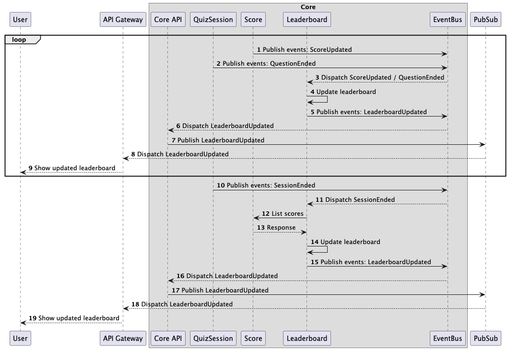

# E-Quiz - A Real-Time Vocabulary Quiz

## Introduction

This project is created to complete Elsa's Coding Challenges.
High-level requirements can be found in
the [Elsa's Coding Challenges repository](https://github.com/elsa/coding-challenges)

## Requirements Analysis

### Functional Requirements

#### Terminology

- **Quiz**: A set of questions that a user can answer.
- **Quiz Session**: A session where a user can participate in a quiz.
- **User**: A person who participates in a quiz session.
- **Question**: A question that a user can answer.
- **Answer**: A user's response to a question.
- **Score**: A user's score in a quiz.
- **Leaderboard**: A list of all users in a quiz session, sorted by their scores.

#### User Participation

- High-level requirements:
    - Users should be able to join a quiz session using a unique quiz ID.
    - The system should support multiple users joining the same quiz session simultaneously.

- Detailed requirements:
    - A user must log in to join a quiz session.
    - A user can join multiple quiz sessions at the same time.
    - A session must have minimum 2 users and maximum 100 users to start.
    - A session must have a minimum of 1 questions and a maximum of 100 questions.
    - A user can join a quiz session in the middle of the session, but can only answer the remaining questions.

#### Real-Time Score Updates

- High-level requirements:
    - As users submit answers, their scores should be updated in real-time.
    - The scoring system must be accurate and consistent.

- Detailed requirements:
    - A user score is limited to the current quiz session.
    - Currently, the system only support multiple-choice questions, where each question has only one correct answer. A
      user gets 1 point for each correct answer, regardless of the question's difficulty or time taken to answer.
    - The submit time is calculated based on the time when the server receives the answer.

#### Real-Time Leaderboard

- High-level requirements:
    - A leaderboard should display the current standings of all participants.
    - The leaderboard should update promptly as scores change.

- Detailed requirements:
    - The leaderboard should be updated after the score of a user is updated, not after the end of each question.
    - Eventual consistency is acceptable for the leaderboard.
    - The leaderboard should be sorted by the user's score in descending order.

### Non-Functional Requirements

#### Scalability

- The system should be able to handle a large number of concurrent users.
- The system can be scaled horizontally to support more users and quiz sessions.

#### Performance

- The system should have low latency for updating user scores and the leaderboard.
- The system should be able to handle the peak load without significant performance degradation.

#### Reliability

- The system should be highly available.
- The system should be fault-tolerant and resilient to failures.
- The system should have a backup mechanism to recover data in case of data loss.

#### Maintainability

- The system should be easy to extend and maintain.

#### Monitoring and Observability

- The system should expose enough logs, metrics, and traces to monitor and debug the system.
- The system should follow OpenTelemetry standards where possible.
- Monitoring should not impact the system's performance while providing enough insights.

## System Design

### Architecture

#### System Context Diagram


#### Container Diagram


- **Participants**: Users who join a quiz session.
- **Frontend**: Web or mobile application that users use to join a quiz session.
- **API Gateway**: An API gateway that routes requests to the appropriate services.
    - The API gateway is behind a load balancer to distribute incoming traffic.
    - The API gateway is responsible for common functionalities such as security, monitoring, caching,...
    - The API gateway also support WebSockets for real-time communication.
- **Core**: The core services of the system.
- **Pub/Sub**: A connector between core services and WebSocket to provide real-time updates.

#### Component Diagram


- **Core API**: Handle incoming requests from the API gateway, and route them to the appropriate services.
- **Session Service**: Manage quiz sessions, including creating, joining, and ending a session. This component provides:
    - API: CreateSession, JoinSession, EndSession, StartQuestion, EndQuestion, ValidateSubmission...
    - Events: SessionCreated, SessionStarted, SessionEnded, UserJoined, QuestionStarted, QuestionEnded...
- **Score Service**: Manage user scores in a quiz session. This component provides:
    - API: SubmitAnswer, ListScores, GetScore...
    - Events: ScoreUpdated
- **Leaderboard Service**: Manage the leaderboard of a quiz session. This component provides:
    - API: GetLeaderboard.
    - Events: LeaderboardUpdated

### Sequence Diagram

#### Quiz Master managing a Quiz Session


#### User Joining a Quiz Session


#### User Answering a Question


#### Leaderboard Update



## Implementation

### Technology Stack

- **Programming Language**: Go
    - Go is my preferred language.
    - It also has good support for concurrency and real-time applications.
- **Database**:
    - PostgreSQL for storing quiz data and user scores, because it provides ACID compliance and is suitable for
      transactional data.
    - Redis for leaderboard caching and real-time updates.
- **Messaging System**:
    - Redis Pub/Sub for real-time WebSocket updates. Although Redis Pub/Sub can't guarantee at-least-once delivery, it
      is simple, fast, and suitable for this use case.
    - Go routines for in-memory event bus, which is simple and efficient. The event bus will help to decouple components
      and can be upgraded to a more robust messaging system like Kafka in the future.

### Directory Structure

```plaintext
.
├── api                 - API definitions
├── cmd                 - Command-line interfaces
│   └── main.go           - Main entry point of the application
├── config              - Configuration files
|── devstack            - Local development stack
├── docs                - Documentation files
├── internal            - Application source code
│   ├── api             - API handlers, including gRPC and Redis Pub/Sub
│   ├── config            - Configuration loader
│   ├── domain            - Domain models, events
│   ├── errors            - Define API errors
│   ├── leaderboard       - Leaderboard service
|   ├── score             - Score service
│   ├── server            - Initialize the application server, wire up dependencies
│   ├── session           - Quiz session service
│   ├── telemetry         - Telemetry and monitoring
|-- test                - Test files
```